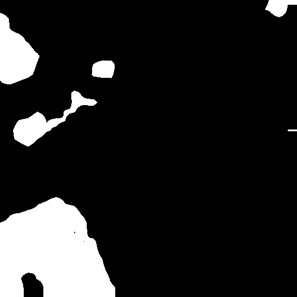

# Image-Segmentation
Segmentation of aerial images using DeepLabv3, to partition these aerial images into two categories buildings and non-buildings (background).

Download the inria dataset from [Inria Aerial Image Labelling Dataset](https://project.inria.fr/aerialimagelabeling/)

1. The resolution of each image in the dataset is 5000 x 5000. So to increase the size of the dataset and decrease the complexity, slice each image into 100 new images each with resolution 500 x 500

        python preprocess.py

2. DeepLabV3 requires pre-trained ResNet weights. [resnet_v2_101_2017_04_14](http://download.tensorflow.org/models/resnet_v2_101_2017_04_14.tar.gz)

3. Train the model and save checkpoints

        python train.py

4. Testing on sample images. copy few images in the preds folder and run this below commad and the segmented maps will be saved in the output folder

        python inference.py

# RGB Image

# Segmented Map

